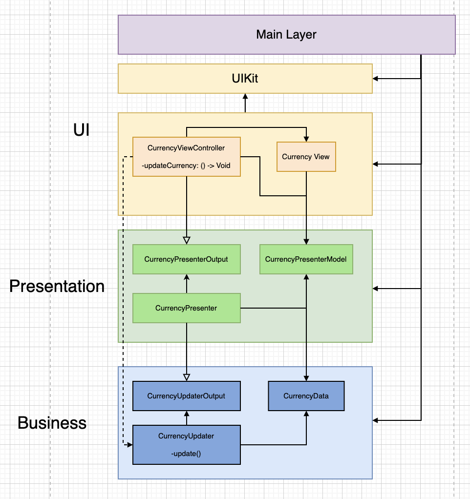

# RedMadRobotWeakReference
Проект для демонстрации Virtual Proxy Pattern

## Описание проблемы
Недавно осознал, что делать ссылки weak, для избежания retain cycle, внутри слоя презентации(Presenter) - не совсем правильное архитектурное решение. 
Во-первых, memmory management - это ответственность, а Presenter ей наделен не должен быть. 
Во-вторых, таким образом мы создаем неявную зависимость в Presenter от объектов, которые кто-то должен держать по strong ссылке.
И, в-третьих, мы вынуждены добавить ограничение для протокола, сделав его class type.  

Для решения этой проблемы я решил использовать **Virtual Proxy** паттерн. Он позволил делегировать ответственность за memmory management главному слою, который занимается компоновкой всех объектов.

На [этом коммите](https://github.com/Le0nX/RedMadRobotWeakReference/commit/30ff7007865d6d06412926b72076d28f4e07291f) проект **содержит retain cycle**.
На [этом коммите](https://github.com/Le0nX/RedMadRobotWeakReference/commit/25624b04ae517b876d61b88058719b5bb7db1de9) в проект добавляется **Virtual Proxy** обертка для избежания retain cycle.

Схематично проект можно изобразить следующим образом:

Исходник схемы: [https://drive.google.com/file/d/1TxY7idlJC1ZMSn83m6a7jDaoTcj9MA18/view?usp=sharing](https://drive.google.com/file/d/1TxY7idlJC1ZMSn83m6a7jDaoTcj9MA18/view?usp=sharing)

Как видно из схемы, у нас есть чистое разделение на слои, и ни один из слоев ниже не знает о слоях выше. Бизнес-логика четко отделана ото всех и не имеет внешних зависимостей. Слой презентации зависит от бизнес-логики, но не имеет понятия о слое UI. UI зависит от UIKit'a и слоя презентации, также он имеет неявную зависимость от бизнес-логики через замыкание. Я специально обозначил линию пунктиром, чтобы было понятно, что зависимость неявная, т.к. композицией всех объектов занимается Main модуль, в моем случае это SceneDelegate. Эта схема позволяет наглядно продемонстрировать чистую архитектуру и retain cycle в ней. 

Первое и самое простое решение, это просто сделать weak зависимость в CurrencyPresenter от CurrencyPresenterOutput. В целом, это решение нормально сработает, но оно реально портит архитектуру. Как я уже написал выше: 
Во-первых, memmory management - это ответственность, а Presenter ей наделен не должен быть.
Во-вторых, мы вынуждены добавить ограничение для протокола, сделав его class type.  

И, в-третьих, в дальнейшем нереально будет подсунуть в Presenter что-то, что не имеет strong внешней зависимости(logger,mock,статистику). В случае с UIViewController'ом - его держит  UIKit. 

Поэтому решением в данном случае является использование Virtual Proxy паттерна, а ответственность за memmory management передается main модулю, который выступает в роли composer'а. На [этом коммите](https://github.com/Le0nX/RedMadRobotWeakReference/commit/25624b04ae517b876d61b88058719b5bb7db1de9) в проект добавляется Virtual Proxy обертка для избежания retain cycle.
